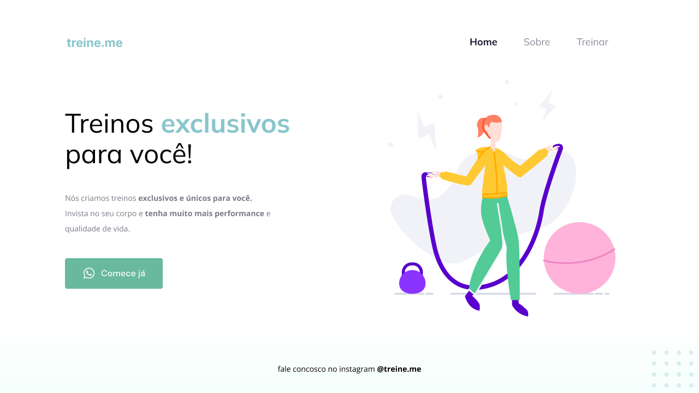

# Projeto 02: Treine.me

### Acesse o projeto: [Aqui](https://jonasncsantos.github.io/Treine.me/)
## Sobre
Projeto desenvolvido durante aula para aplicação dos conhecimentos ensinados no curso Explorer da [Rocketseat](https://www.rocketseat.com.br/") no Stage 02.

## Aprendizados
- Elementos HTML Semântica
- Lista ordenas e não ordenadas do HTML
- Diferença de `div` para `section`
- Conceito de Box Model do CSS
- Conhecendo a ferramentas de desenvolvimento DevTools
- Conceito de Flexbox do CSS
- Acessibilidade
- refatoração de código
- Efeito Hover do CSS
- `text-transform` do CSS
- Propriedade de padding do CSS
- Propriedade de background do CSS
- Propriedade de border-radius do CSS
- Linear gradiente no CSS